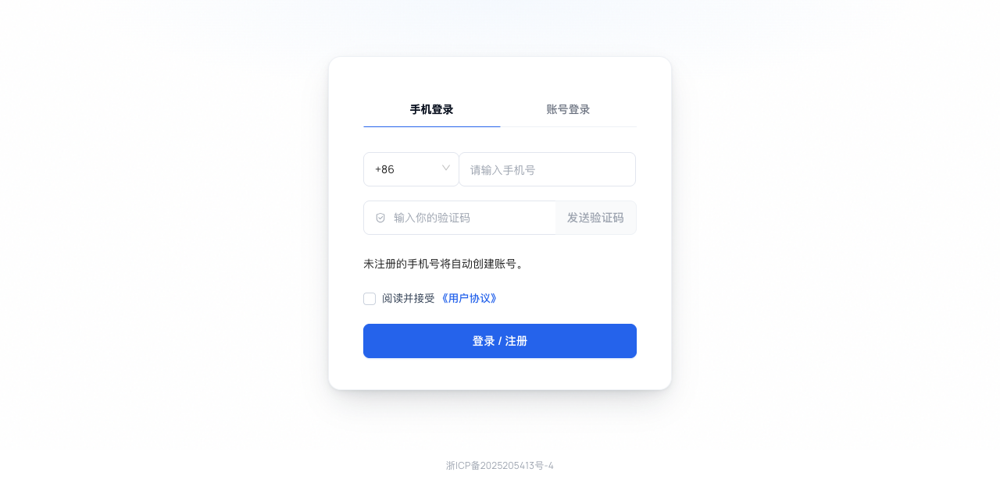
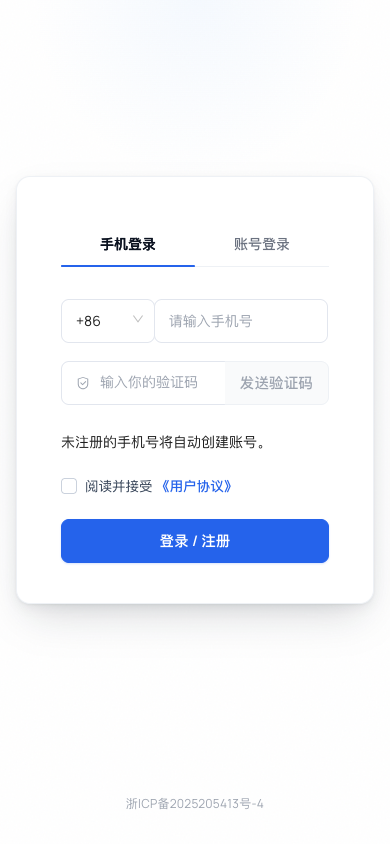

> 历史测试记录：本文描述 2026-09-21 的试验版本和测试服状态，不代表当前生产范围。当前实现以 [2026-09-22 生产记录](phone-login-production-2026-09-22.md) 为准。相关试验 PR 已关闭。

> 方案已修正：Matrix 保留原页面，Casdoor 保留原生托管外观。下方“迁入 Matrix 视觉”的历史截图与记录已失效，不作为当前验收依据。当前实现见 phone-signin-signup.md；嵌入登录及浏览器 POST 交接已完成本地 PostgreSQL HTTP 回归，测试服验收另行补充。

# Casdoor 手机号一体登录／注册：本地验收记录

日期：2026-09-21。本页记录本地隔离验收。后续已完成测试服发布与真实短信老账号登录，见 [测试服验收](phone-auth-test-deployment-2026-09-21.md)。生产和 Matrix／子应用入口尚未切换。

## 已实现

- 应用级 `enablePhoneSigninSignup`，默认关闭；已有应用不会自动启用。
- 默认手机登录、手机号＋验证码、“登录 / 注册”按钮及未注册号码提示；账号登录保留密码与找回密码。
- 旧注册页面在启用模式下复用统一表单，保留 OAuth 参数；旧注册 API 保留。
- Casdoor 自己完成新老用户分支、新身份创建、原账号登录及授权回跳；保留原 sub。
- 号码级冷却与日限额、验证码最新记录单次消费、错误次数限制及 PostgreSQL 号码锁。
- 在建号或消费验证码之前校验 OIDC 应用和回调；禁止用另一组织替换请求。
- 修复页面预加载配置时未初始化登录方式、区号初始化触发空号码报错，以及账号密码切回手机时残留密码影响请求的问题。

## Matrix 外观对齐

第二阶段按“Matrix 外观、Casdoor 托管”落地。只为开启一体认证的应用增加渐变网格背景、玻璃卡片、品牌区、分段标签、字段标签与独立验证码按钮；应用名称和 Logo 从 Casdoor 配置读取。账号密码页同步使用同一外观。

生产 Matrix 登录页仅作只读视觉参考。截图中的 Matrix 名称来自本地合成应用配置；没有修改生产配置、Matrix 登录入口或子应用接入方式。协议显式勾选、可选国际区号保留，增长邀请码未迁入 Casdoor。

## 环境与边界

代码基线与 origin/mozia 对齐（db763bc0）。使用本机一次性 PostgreSQL 数据库，测试组织和账号均为合成数据；无生产数据库连接。HTTP 测试中的短信发送只访问 127.0.0.1 的模拟供应商，不发送真实短信。

浏览器运行本次正式前端构建和本地 Casdoor 后端。测试应用配置了手机、密码两个入口和本地协议占位内容；它不是生产应用完整配置的复制。浏览器回调接收器验证授权码换令牌、PKCE 与 nonce，不调用 Matrix。

## 自动化结果

| 检查 | 结果 |
| --- | --- |
| Go phoneauth、object、controllers 相关测试，含 PostgreSQL 多连接锁 | 通过 |
| 新老手机号 sub 连续、授权码换 token、PKCE、nonce、Casdoor Session、验证码重放拒绝 | 通过 |
| 未同意协议、关闭注册、组织参数替换 | 通过 |
| 并发注册仅创建一个账号 | 通过 |
| 旧注册 API 与密码登录 | 通过 |
| 非法授权应用／回调在建号、消费验证码前拒绝 | 通过 |
| 禁用用户、关闭注册后老用户登录、关闭功能后的旧验证码登录 | 通过 |
| 已有浏览器 Session 继续 OAuth 授权 | 通过 |
| 实际发码接口→本机短信桩→注册；重复发码 429；关闭注册拒绝未知手机号发码 | 通过 |
| 前端 phoneSignin Jest，4 项 | 通过 |
| Go 构建、前端生产构建、修改的 JS 文件 ESLint、diff 空白检查 | 通过 |

HTTP 测试入口为 `scripts/test-phone-signin.py`；运行方式见 [使用说明](phone-signin-signup.md)。脚本修复了合成验证码缺少 created_time 导致同秒新旧记录排序不确定的问题，测试记录现在提供精确创建时间。

## 浏览器结果

| 场景 | 结果 |
| --- | --- |
| 桌面默认手机入口 | 两个标签、手机号、验证码、协议和一体按钮正常；无用户名／密码注册字段 |
| 375、390、768、1024、1440 宽度 | 文档宽度与视口一致，无横向溢出；桌面卡片 448px、小屏卡片随视口缩放 |
| 390×844 手机页面 | 输入、发送按钮、协议及提交按钮完整展示，无横向裁切；首次进入无空号码错误 |
| 手机页面填写号码并发码 | 实际请求本地 Casdoor，显示 60 秒倒计时 |
| 未勾选协议提交 | 页面阻止提交并提示同意协议 |
| 手机浏览器新用户提交 | 完成注册及回调；接收器确认 PKCE 换令牌与 nonce |
| Matrix 外观下新手机号完整注册 | 独立发码按钮请求本地短信桩；未同意协议时阻止提交；同意后授权码回调、PKCE、nonce 通过 |
| 深色主题与减少动态效果 | 390px 深色页面无裁切，背景及表单可见；减少动态效果时按钮 transition 为 0s |
| 账号页布局 | 账号、密码标签及找回密码可见；登录按钮与表单同宽，不被浮动元素挤压 |
| 关闭一体模式开关 | 原登录面板及独立注册链接恢复，新布局未渲染；检查后已恢复本地开关 |
| 旧 /signup/oauth/authorize 链接 | 显示同一手机号表单，无单独用户名密码注册流程 |
| 从账号页输入密码再切回手机号 | 手机验证码登录成功，未被旧密码干扰 |
| 旧注册链接下完成已有手机号登录 | 完成授权码回调、PKCE 和 nonce 验证 |

## 上线前仍需完成

1. 真实短信供应商投递、模板与配额验收，以及生产等价应用配置的测试服验证。
2. 现有组织手机号重复与地区绑定检查；其他未启用应用的注册、管理员建号和绑定手机号入口不受当前号码锁完整约束。
3. MFA 和现有第三方身份提供方的真实回归；本次未用生产第三方账号登录。
4. 正式协议地址与版本同意留痕机制。当前实现校验勾选，不宣称已经提供独立的版本化协议记录。
5. Matrix 及三个子应用接入、增长奖励、代理商归属与跨应用退出。这些属于后续阶段，本 PR 不变更它们。

回退原则：先在测试环境验证关闭应用开关并恢复旧入口，保留已创建身份。不要删除用户或回滚用户数据。当前尚未执行服务器发布和回退演练。
